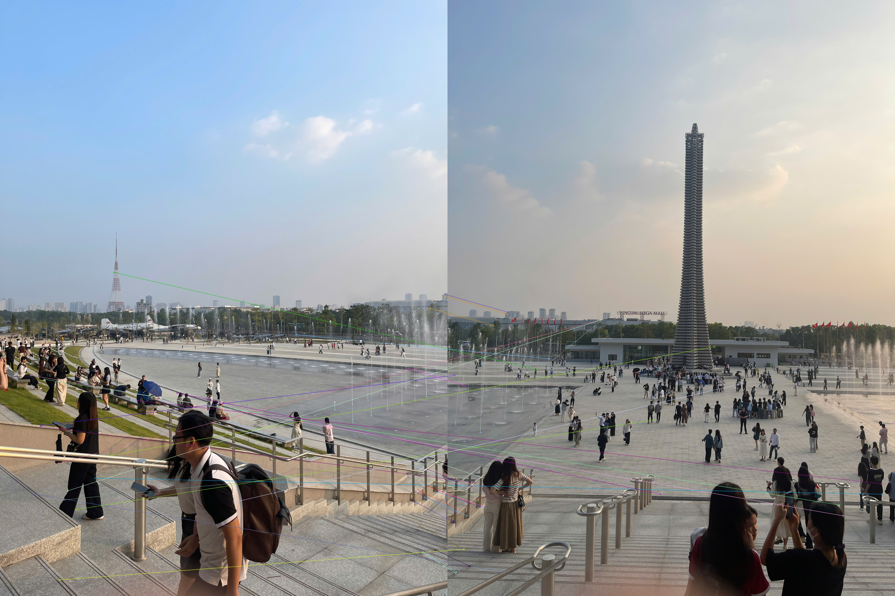
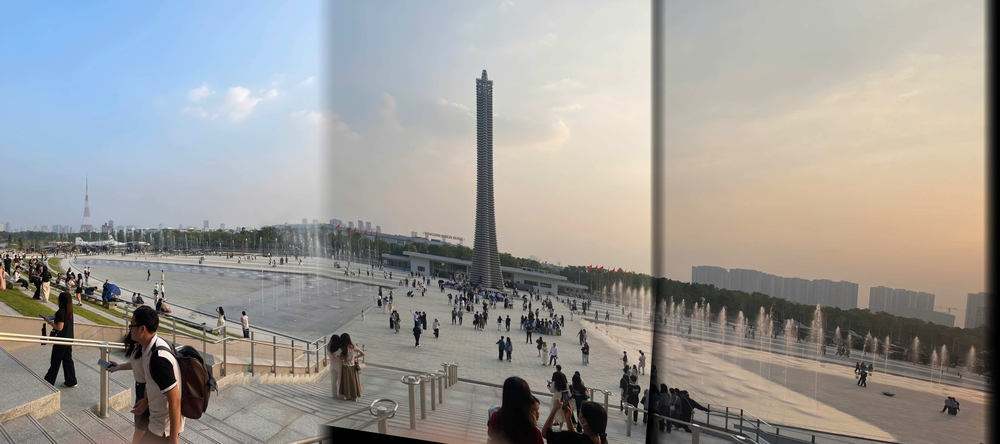

# 🧵 Image Stitching using SIFT and Homography

This project implements an image stitching pipeline using OpenCV's SIFT feature detector and homography transformation. It aligns and blends multiple overlapping images into a seamless panorama.

---

## ✨ Features

- Feature detection and matching using SIFT
- Homography estimation using RANSAC
- Smooth image blending using masks
- Sequential stitching for multiple images
- Visualization of matching keypoints

---

## 🖥️ Requirements

- Python 3.x
- OpenCV with `xfeatures2d` module (use `opencv-contrib-python`)

```bash
pip install opencv-contrib-python numpy
```

---

## ▶️ How to Run

Place your images inside the i/ folder in order of stitching.
Then run:

```bash
python main.py
```

## 🖼️ Example Outputs

🔍 Keypoint Matching Between First Two Images 
Shows feature matches found between the first two images.

<p align="center">  </p>

🧵 Final Stitched Image (7_result.jpg)
Final panorama result after stitching all input images.

<p align="center">  </p>

## 🧠 Notes

Images should have enough overlap for SIFT to find reliable keypoints.

You may adjust the order or change the smoothing_window_size in the code for different blending results.